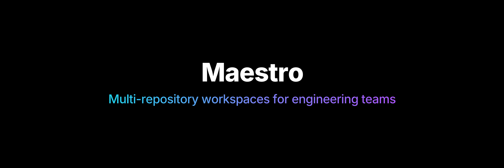
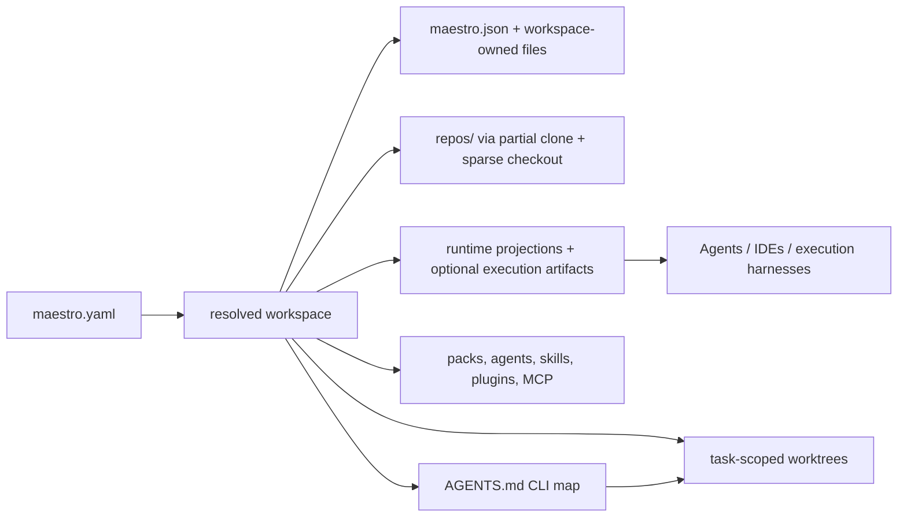

<p align="center">
  <picture>
    <source media="(prefers-color-scheme: dark)" srcset="./docs/assets/banner-dark.png">
    <source media="(prefers-color-scheme: light)" srcset="./docs/assets/banner-light.png">
    
  </picture>
</p>

<p align="center">
  <a href="https://github.com/Th3Mouk/maestro/actions/workflows/ci.yml?query=branch%3Amain">
    
  </a>
  <a href="https://www.npmjs.com/package/@th3mouk/maestro">
    
  </a>
  <a href="https://www.npmjs.com/package/@th3mouk/maestro">
    
  </a>
  <a href="https://github.com/Th3Mouk/maestro/releases/latest">
    
  </a>
  <a href="https://github.com/Th3Mouk/maestro/blob/main/LICENSE">
    
  </a>
  <a href="https://github.com/Th3Mouk/maestro/blob/main/docs/cli/install.md">
    
  </a>
</p>

# Maestro

> Multi-repository workspaces for engineering teams

[Architecture](./docs/architecture/overview.md) • [Technical stack](./docs/architecture/technical-stack.md) • [Dependency policy](./docs/architecture/dependency-governance.md) • [CLI install](./docs/cli/install.md) • [5-minute quickstart](./docs/cli/quickstart.md) • [CLI](./docs/cli/commands.md) • [Workspace Manifest](./docs/manifests/workspace.md) • [Manifest Fragments](./docs/manifests/fragments.md)

## Why this exists

Most engineering work still spans several repositories, while many AI coding tools still assume one runtime working inside one repository.
That model breaks down when the real task is a coordinated rollout across several repositories with different scopes, policies, and operational risks.

Maestro prepares partial or complete multi-repository workspaces.
It lets teams expose only the code they need, reduce unnecessary context for AI runtimes, share packs across teams, and run the same workspace locally or in the cloud without forcing a monorepo.

Maestro sits upstream of agent tools, execution harnesses, and IDEs.
It prepares a governed workspace that a developer, an agent, or an editor can consume from the same folder without guessing the scope, layout, or rules.

Maestro introduces partial or complete multi-repository workspaces on top of Git:

- version the workspace root as a lightweight Git repository that owns the contract, local policies, overrides, and workspace-specific files;
- initialize the workspace root as a Git repository on first install, then install full Git repositories or sparse checkouts into that workspace under `repos/` by omitting `sparse` or by combining `includePaths` / `excludePaths`;
- create an initial `🪄 booted by Maestro` commit at the end of the first setup when the workspace repository is still unborn;
- materialize only the files downstream tools should see when a partial workspace is enough, or the full repository when it is not;
- bootstrap repository dependencies with `maestro bootstrap`, which auto-detects `composer`, `uv`, `npm`, `pnpm`, `yarn`, and `bun` in the cloned repositories;
- emit `maestro.json`, the neutral descriptor for agents, harnesses, scripts, and other tooling;
- distribute workspace assets through packs;
- version native plugin bundles and repo-local plugin marketplaces alongside the workspace contract;
- prepare runtime-specific configuration and optional execution artifacts for downstream tools and cloud execution;
- keep the resulting folder consumable by agents, headless harnesses, and IDEs, with tools such as VS Code or JetBrains opening the workspace root for setup and the task worktree root for active work;
- generate `maestro.code-workspace` on demand for editors that support named multi-root workspaces;
- project optional DevContainer artifacts from the workspace configuration when a team wants a containerized local environment;
- create task-scoped worktrees so downstream agents and harnesses can work in one task worktree that contains the root worktree plus one worktree per managed repository;
- run workspace-managed Git operations across repositories.

By default, `maestro init` enables Codex and Claude Code only. Pass `--runtimes opencode` when you explicitly want OpenCode projections in the scaffold.

For example, a repository entry can keep the whole checkout:

```yaml
spec:
  repositories:
    - name: docs-site
      remote: git@github.com:org/docs-site.git
      branch: main
```

Or keep broad folders visible and hide a few nested paths:

```yaml
spec:
  repositories:
    - name: app
      remote: git@github.com:org/app.git
      sparse:
        includePaths:
          - src/
          - docs/
        excludePaths:
          - src/generated/
          - docs/internal/
```

## What it looks like



## Core capabilities

| Capability                       | What it gives you                                                                                                                                              |
| -------------------------------- | -------------------------------------------------------------------------------------------------------------------------------------------------------------- |
| Multi-repo workspaces            | One source of truth for a workspace repo plus the Git repositories it installs and governs                                                                     |
| Partial or complete scope        | Expose only the code a task needs, or keep full repositories when broad context is required ([workspace manifest](./docs/manifests/workspace.md))              |
| Controlled context               | Smaller context windows and less irrelevant code for AI runtimes                                                                                               |
| Shared packs                     | Packs and plugin bundles for distributing agents, skills, policies, templates, and runtime-specific assets ([Pack core](./examples/packs/pack-core/pack.yaml)) |
| Runtime adapters                 | Optional projections for specific tools without making Maestro the runtime or editor itself                                                                    |
| Framework-managed execution      | Bootstrap scripts, isolated worktrees, and optional DevContainer artifacts generated from the workspace configuration                                          |
| Local or cloud-hosted workspaces | The same workspace contract can be prepared for local use or controlled remote execution                                                                       |
| Policy-backed operations         | Guardrails for branch naming, path restrictions, diff size, and workflow safety                                                                                |

Architecture decisions and implementation constraints are documented in the architecture pages linked above.

## Install

Node.js `>=22.12` is required for npm, pnpm, npx, and pnpm dlx installs. The published CLI is a Node program, so the installed command still runs through Node at runtime. For the full matrix and Homebrew notes, see [CLI install](./docs/cli/install.md).

Choose the simplest path for your machine.

| Path                 | Command                                                                                                 |
| -------------------- | ------------------------------------------------------------------------------------------------------- |
| npm global           | `npm install -g @th3mouk/maestro`                                                                       |
| pnpm global          | `pnpm add -g @th3mouk/maestro`                                                                          |
| npx, no install      | `npx @th3mouk/maestro@latest init my-workspace`                                                         |
| pnpm dlx, no install | `pnpm dlx @th3mouk/maestro@latest init my-workspace`                                                    |
| Homebrew on macOS    | `brew tap th3mouk/maestro https://github.com/Th3Mouk/maestro`<br>`brew install th3mouk/maestro/maestro` |

The Homebrew core namespace already has an unrelated `maestro` cask, so the tap plus fully qualified formula name is the honest install path today.

After installation, start here:

```bash
maestro --help
maestro init my-workspace
maestro doctor --workspace ./examples/ops-workspace
```

## 5-minute quickstart

Start from an empty directory and let `maestro init` create the workspace skeleton.

```bash
maestro init my-workspace
cd my-workspace
maestro install --workspace . --dry-run
maestro bootstrap --workspace .
maestro doctor --workspace .
```

That quick path shows the expected lifecycle without duplicating the full walkthrough. For the generated files, task worktree flow, and editor-specific steps, see [5-minute quickstart](./docs/cli/quickstart.md).

## Contributing

Contribution and repository-development guidance lives in [CONTRIBUTING.md](./CONTRIBUTING.md).
This README stays focused on the framework itself.

## What This Is Not

- not a monorepo replacement
- not a generic agent shell
- not a local cockpit for chat, diff review, and merge loops
- not a promise of autonomous repository management without review
- not a packaging of the repository-maintenance automation used while developing Maestro

## What is already in the repository

The repository already includes:

- a working CLI in [`src/cli/main.ts`](./src/cli/main.ts)
- direct CLI command wiring to concrete modules in [`src/core/commands/`](./src/core/commands/)
- manifest schemas backed by Zod in [`src/workspace/schema.ts`](./src/workspace/schema.ts)
- Git and GitHub adapters in [`src/adapters/`](./src/adapters/)
- example workspaces in [`examples/`](./examples/)
- integration tests that exercise real local Git repositories in [`tests/integration/workflow.test.ts`](./tests/integration/workflow.test.ts)
- validation gates that include `knip` for unused files, exports, dependencies, and binaries, alongside `oxlint`, `oxfmt`, `tsc`, `vitest`, smoke checks, and pack verification
- tarball verification that installs the packed artifact and runs public smoke checks through [`scripts/verify-packed-artifact.mjs`](./scripts/verify-packed-artifact.mjs)

The current engineering guarantees and dependency rules are tracked in [`docs/architecture/technical-stack.md`](./docs/architecture/technical-stack.md).

## Examples

- [Ops workspace](./examples/ops-workspace/maestro.yaml)
- [Backend workspace](./examples/backend-workspace/maestro.yaml)
- [Pack core](./examples/packs/pack-core/pack.yaml)
- [Pack GitHub Actions](./examples/packs/pack-github-actions/pack.yaml)
- [Pack private](./examples/packs/pack-private/pack.yaml)
- [Pack Symfony](./examples/packs/pack-symfony/pack.yaml)

## Documentation map

- [CLI install](./docs/cli/install.md)
- [5-minute quickstart](./docs/cli/quickstart.md)
- [Architecture overview](./docs/architecture/overview.md)
- [Technical stack](./docs/architecture/technical-stack.md)
- [CLI reference](./docs/cli/commands.md)
- [Workspace manifest](./docs/manifests/workspace.md)
- [Manifest fragments](./docs/manifests/fragments.md)

## Contributing and trust

- [Contributing guide](./CONTRIBUTING.md)
- [Security policy](./SECURITY.md)
- [Support guide](./SUPPORT.md)
- [Code of conduct](./CODE_OF_CONDUCT.md)

## Project status

This repository contains a practical public foundation.
The package must install cleanly, the documented flow must run, and the published artifact must match the documented features.

The pull request automation lives in [`.github/workflows/ci.yml`](./.github/workflows/ci.yml) and runs the full validation checks on every non-draft PR update.
It installs dependencies with `pnpm install --frozen-lockfile`, runs the repository validation checks in a matrix on Node `22.12.x` and `24.x`, and uploads the generated npm tarball as a workflow artifact after the packed artifact has been installed and smoke-tested.

The release preparation automation lives in [`.github/workflows/release.yml`](./.github/workflows/release.yml).
It is started manually from GitHub Actions with a `patch`, `minor`, or `major` choice, then bumps the package version, opens a release PR, and enables auto-merge.
The publication automation lives in [`.github/workflows/publish-release.yml`](./.github/workflows/publish-release.yml).
It runs only after that release PR is merged into `main`, then publishes the tarball to npm under `@th3mouk/maestro` through GitHub Actions OIDC trusted publishing, creates the matching release tag, attaches that same tarball to the GitHub release, and updates the Homebrew formula with the SHA of the published tarball.
If a partial failure happens after the merge, rerun the publication workflow instead of preparing another release PR.
The publish job assumes the release PR already passed the PR CI gate, so it does not rerun the full validation matrix before publishing.
npm requires the package to exist before a trusted publisher can be attached, so the first npm release still needs a one-time bootstrap before the OIDC trust relationship can take over.
